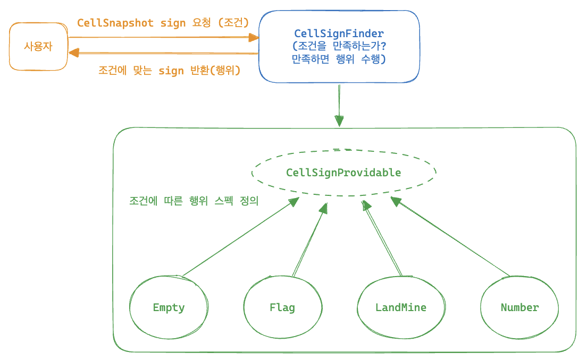
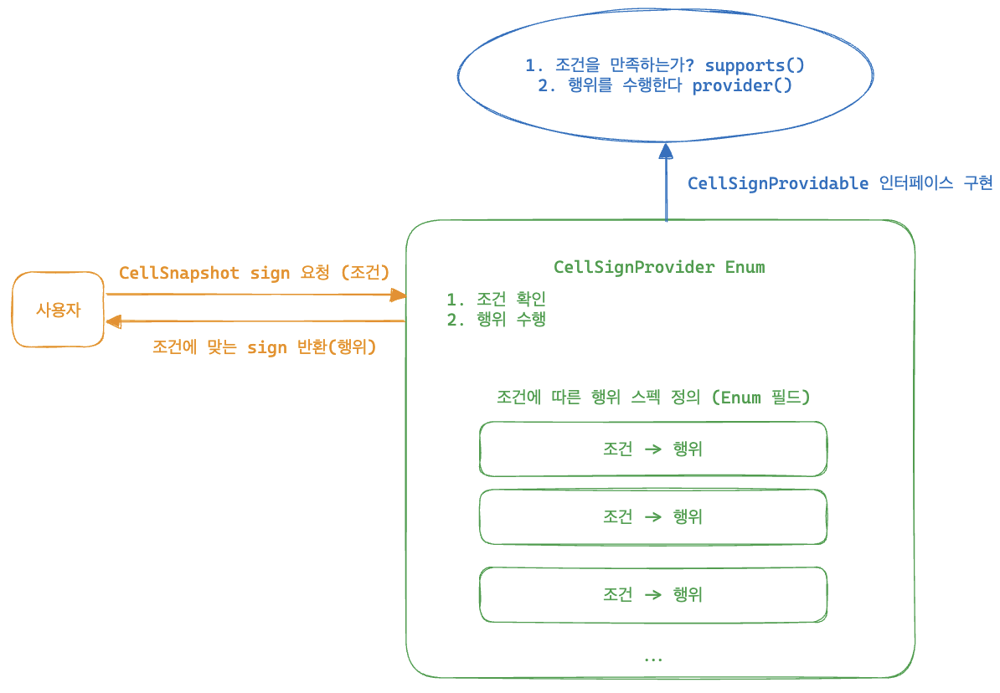

# Readable Code

### 박우빈님의 [Readable Code: 읽기 좋은 코드를 작성하는 사고법](https://www.inflearn.com/course/readable-code-%EC%9D%BD%EA%B8%B0%EC%A2%8B%EC%9D%80%EC%BD%94%EB%93%9C-%EC%9E%91%EC%84%B1%EC%82%AC%EA%B3%A0%EB%B2%95/dashboard)을 수강하고 정리한 글입니다.

---

## 지뢰찾기 게임

### step 1: 추상

**도메인 용어 정리**

- `board`: 게임판
- `landMine`: 지뢰
- `gameStatus`: 게임 진행 상태

</br>

**이름 짓기**

- (가로, 세로): (`row`, `col`)
- 좌표 입력: `cellInput`
- 입력된 (가로, 세로): (`cellInputCol`, `cellInputRow`)
- 입력된 값의 좌표상 값: (`selectedColIndex`, `selectedRowIndex`)
- 수행할 행위 입력: `userActionInput`

</br>

**메서드 추상화하기 (추상화 레벨 맞추기)**

- 안내 문구 출력 메서드: `showGameStartComments()`
- 게임 세팅 초기화: `initializeGame()`
- 게임판 출력: `showBoard()`
- 입력된 col 값을 실제 좌표 상의 값으로 변환: `converColFrom(char cellInputCol)`
- 입력된 row 값을 실제 좌표 상의 값으로 변환: `converRowFrom(int cellInputRow)`
- 게임이 끝났는지 체크: `checkIfGameIsOver()`
  - 셀이 전부 열렸는지 체크: `isAllCellOpened()`
- 지뢰를 모두 찾았는가?: `doesUserWinTheGame()`
- 지뢰를 밟았는가?: `doesUserLoseTheGame()`
- 유저에게 좌표 입력 받기: `getCellInputFromUser()`
- 유저에게 행위 입력 받기: `getActionInputFromUser()`
- 입력으로부터 실제 좌표값 얻기: `getSelectedRowIndex()`,`getSelectedColIndex()`
- 사용자가 깃발을 선택했는가?: `doesUserChooseToPlantFlag()`
- 사용자가 오픈을 선택했는가?: `doesUserChooseToOpenCell()`
- 선택한 셀이 지뢰인가?: `isLandMineCell()`
- 지뢰를 밟은 경우 게임 상태 변경: `changeGameStatusToLose()`
- 전부 오픈한 경우 게임 상태 변경: `changeGameStatusToWin()`

</br>

**상수 추출하기**

- board, landMineCounts, landMines 배열은 그 자체의 값은 변하지 않으므로 상수
  - 그 안의 값이 바뀌는 것
  - gameStatus는 값이 변하므로 X
- `static final 반환타입 대문자상수명`
- `BOARD`, `NEARBY_LAND_MINE_COUNTS`, `LAND_MINES`
- 게임판의 가로 세로 길이도 자주 사용되므로 상수로 추출: `BOARD_ROW_SIZE, `BOARD_COL_SIZE`
  - 상수로 변환할 때 로직 체크 필수. 같은 값인데 의미가 다른 경우 주의
- 지뢰 개수: `LAND_MINE_COUNT`
- 셀의 4가지 상태: `FLAG_SIGN`, `LANE_MINE_SIGN`, `CLOSED_CELL_SIGN`, `OPENED_CELL_SIGN`

</br>

### step 2: 사고의 흐름이 자연스럽도록 개선

**Early return**

1. 메서드로 추출
2. if문 빠르게 return해서 else문 없애기

</br>

**depth 줄이기**

- 메서드 분리를 통해 중첩문의 depth를 줄인다.
- 사고의 depth를 줄이는 것에 집중할 것. 무조건 depth를 줄이려고 메서드 쪼개기만 한다면 더 복잡해질 것.

  - 이번 도메인의 경우 row와 col은 항상 이중 포문으로 같이 사용되기 때문에 depth를 줄이겠다고 메서드 분리를 하면 더 복잡해진다.
- tip) 메서드 리팩토링 시에는 메서드 복제 후 하는 것이 컴파일 에러를 최소화하면서 할 수 있다.

  - 메서드 복제 -> 메서드 리팩토링 -> 사용되는 곳에서 리팩토링 한 메서드로 대체해보기 -> 전부 대체 가능하면 기존 메서드 삭제 -> 리팩토링한 메서드명 기존 메서드명으로 변경
- 2중 for문으로 row, col을 접근하는 것은 게임판 전체에 접근하고 싶다는 의미: stream으로 모든 원소에 접근하는 방식으로 개선

  ```java
              Arrays.stream(BOARD)
                  .flatMap(Arrays::stream)
                  // ...
  ```
- 사용할 변수는 가깝게 선언하자

  - 자주 사용되고, 무거운 변수는 상수로 빼는 것도 고려해보자
- 공백을 통해 논리의 흐름을 끊어주자

</br>

**부정 연산자 피하기**

- 부정연산자 대신 반대되는 의미의 메서드를 사용하거나 메서드 자체에 부정의 의미를 담아서 개선
- `!isLeft()` -> `isRight()` 또는 `isNotLeft()`

</br>

**예외 처리**

- 예외 발생 가능성을 최대한 낮추고, 의도된 예외들은 알맞게 처리해주기
- 잘못된 입력이 들어왔을 때 프로그램이 종료되는 것이 아닌 사용자가 다시 입력할 수 있도록 처리
- `NullPointException` 대처, Optional 잘 알고 최대한 적게 사용하기

  - `equals()`와 같은 비교 메서드에서 NPE가 발생할 가능성 있다
  - `cell.equals(CLOSED_CELL_SIGN)` -> `CLOSED_CELL_SIGN.equals(cell)`
  - 검증된(확실히 존재하는) 값을 기준으로 비교 메서드 사용

</br>

### Step 3: 객체 지향 패러다임

**객체 설계**

- 기존에 게임판, 근처 지뢰 횟수, 지뢰 정보가 전부 따로 관리되고 있었다.
- row, col 사이즈도 똑같고, 하나의 셀의 특성이므로 객체로 관리할 수 있다. -> Cell 객체
- 기존의 4가지 SIGN 정보도 Cell 객체 내부에서 관리할 수 있다.

  - 정적 팩토리 메서드로 생성하도록 하고, 생성자는 private로 숨긴다. (항상 정답은 아니겠지만 정적 팩토리 메서드를 사용하면 메서드명을 줄 수 있어서 좋다.)
  - getter는 정말 필요할 때, setter는 그냥 만들지 말자
- `Cell[][]` 기반의 `BOARD2`를 만들어서 점진적으로 기존의 BOARD를 대체해가면서 리팩토링하자

  - 기존에 그냥 `SIGN값을` 넣어줬다면 이제는 `Cell.of(SIGN)`
- Cell의 SIGN 정보를 비교할 때에는 getter를 만드는 것이 아닌 Cell에 물어보는 방식(메서드)으로 구현

  - `cell.equalsSign(SIGN)`
- `showBoard()` 에서는 Cell에 그림을 그려달라고 하는 것이 더 이상하다. 그리는 쪽이 호출하는 쪽이니까 이럴 때에는 Cell에 물어보는 것이 아닌 getter를 사용해야할 때이다.
- 4가지 SING 상수 필드들도 전부 Cell 클래스 안에 넣는다. (같은 관심사이므로 묶기)

  - Cell 내부에서만 해당 사인들을 다룰 수 있도록 리팩토링한다.
- NEARBY_LANE_MINE_COUNT와 LAND_MINES 모두 Cell 안에서 다룰 수 있으므로 객체 안으로 집어넣자

  - Cell 안의 nearbyLandMindCount, isLandMine 필드로 표현 가능하다.

추가한 필드에 맞게 생성자들과 메서드들을 수정하다 보니 이상한 점이 있다. 사인들을 가질 때 추가한 두 필드의 값이 정해지지 않을 수 있다는 것이다.

- Cell이 가진 속성: 근처 지뢰 숫자, 지뢰 여부
- Cell의 상태: 깃발 유무, 열림 여부, 사용자의 확인 여부
  - 깃발이 꽂혔다는 것은 열리지는 않았지만 사용자가 확인은 한 상태이다.

기존의 게임 종료 조건은 모든 셀이 닫혀있지 않은 상태였지만, 사실은 모든 셀이 열려있거나 닫혀있는데 사용자가 깃발로 확인한 경우가 종료 조건이 되는 것이다.

</br>

**새로 얻게된 도메인 지식**

- opened / closed 개념과 사용자가 확인했다는 개념은 다르다.
- 즉, 닫혀있지만 깃발로 사용자가 확인한 경우 게임 종료 조건의 일부가 된다.
  - 따라서 모든 셀이 깃발이 꽂혀있거나, 오픈되어있는 경우가 게임 종료 조건이 된다.
- 또한, Cell의 정보가 변경되었을 때 Cell을 새로 만들어서 갈아 끼우는 것이 아니라 Cell이라는 객체의 상태를 변화시키는 방향으로 리팩토링해야한다.
  - 기존엔 지뢰 여부와 주변 지뢰 개수를 별도의 배열로 관리했기에 새로 갈아끼우기가 가능했던 것이다.

</br>

**리팩토링 과정**

- LAND_MINE의 배열 대신 BOARD의 해당하는 Cell에 대해 메서드를 통해 지뢰 상태를 변경할 수 있도록 한다.
- NEARBY_LANE_MINE_COUNTS의 초기화는 Cell 생성 시 해당 필드를 0으로 초기화하니까 없애도 된다.

  - 마찬가지로 이 외의 값 변경은 전부 Cell이 제공하는 메서드로 대체한다.
- 깃발은 isFlagged 필드로, 오픈 여부는 isOpened 필드로 만들어 상태 변경으로 표현한다.

  - 기존엔 FLAG 사인과 OPENED 사인으로 새로 Cell 생성해서 대체했었다.
- 모든 값들은 전부 상태로 관리될 수 있다. 강제로 객체를 새로 만들어서 사용하지 말자.

</br>

**SRP: 단일 책임 원칙**

1. 기존에 하나의 클래스(`MinesweeperGame`)로 구성된 것을 책임에 따라 분리해보자

- main 함수에서 모든 지뢰찾기 게임을 진행하고 있는데 main은 딱 프로그램을 실행하는 책임만 주고, 지뢰 게임은 `Minesweeper` 클래스로 따로 분리하자
  - main은 딱 `Minesweeper`를 생성해서 실행해주기만 함
  - main이라 static 키워드를 사용했었는데 클래스 분리하고 나서는 붙여줄 필요 없음

2. 입력과 출력 책임 분리

- 분리할 때 필요한 상수들은 같이 옮겨주던지 파라미터로 받던지 상황에 따라 선택하자
- 입력에 관한 건 전부 `ConsoleInputHandler`
- 출력에 관한 건 전부 `ConsoleOutputHandler`
  - 게임 시작 문구 출력 (`showGameStartComments()`)
  - 게임판 보드 출력 (`showBoard()`)
  - ...
- printExceptionMessage()의 파라미터는 에러 자체 e를 넣어주는 게 나을까 `e.getMessage()`를 넣어주는 게 나을까?
  - 정답은 없지만 메서드 선언부와 커스텀 에러의 다른 메서드들을 고려했을 때 에러 자체인 e를 넣어주는 게 나아보인다.

3. Board의 역할이 너무 많다. 상수로 관리하기에는 책임이 너무 많기 때문에 객체로 분리해보자

- row, col 크기만 알려주면 그 내부에는 Cell로 구성된 이중 배열인지는 알 필요 없이 GameBoard 객체 내부에서 관리되도록 분리한다.

  - Minesweeper 입장에서 GameBoard가 이중 Cell로 이루어져있는지 알지 못하고, 관심도 없다. (객체로 추상화되고, 캡슐화로 은닉되었기 때문)
- Board를 생성하고 초기화하고 이런 모든 관련된 작업들을 이제 다 GameBoard 객체로 책임을 분리해준다.
- `board[row][col].getSign()` -> 매우 무례하다!

  - cell에 접근해서 사인 바로 가져오는 건 cell 사용할 것도 아니면서 무작정 가져오는 일.
  - board에 정중히 sign값을 요청하자: `gameBoard.getSign(row, col)`
- 재귀적으로 주변을 돌면서 오픈하는 메서드도 gameBoard가 내부적으로 처리하도록 분리해줬다.

</br>

**OCP: 개방-폐쇄 원칙**

- 새로운 요구사항이 들어왔을 때 기존의 코드 변경 없이 시스템을 확장할 수 있어야 한다.

  - 새로운 요구사항
    - 게임의 난이도를 변경할 수 있어야 한다. (매우쉬움, 초급, 중급, 고급)
- 현재 상수로 이미 정해져있기 때문에 OCP를 지키지 않고 있는 상태이다.

1. 난이도에 따라 게임판 세팅이 유연하게 될 수 있도록 수정

- 난이도에 따라 유연하게 게임판의 크기를 조절하는 작업도 또 하나의 책임으로 보고 클래스로 분리한다. (SRP 원칙)
- 게임의 난이도를 인터페이스를 활용해 만들고, 난이도가 변경될 때마다 인터페이스의 구현체로 변경된 난이도의 클래스를 넣어주자
  - 인터페이스야 말로 추상화의 직접적인 표현
  - 
  - 인터페이스인 GameLevel을 Minesweeper에 넣어주는데 인터페이스라서 런타임 시점(프로그램 실행 시점)에 어떤 구현체(난이도)가 들어올지 모르는 상태이다.
    - 하지만 추상화된 인터페이스 스펙(메서드)를 알고 있기 때문에 유연하게 게임을 실행할 수 있는 것이다. (OCP 만족)
    - Enum 사용도 고려해볼만 하다. (GameLevel이 정해지면 변하지 않고, 레벨마다 사용하는 값들도 정해져 있어 Enum이 더 어울릴지도?)

</br>

**LSP: 리스코프 치환 원칙**

- Cell를 abstract 클래스로 지정하고 Cell을 상속한 지뢰 Cell, 숫자 Cell, 빈 Cell 자식 클래스를 만들자
  - abstract 클래스이므로 만들었으므로 생성자, create 삭제
  - 먼저 공통으로 사용되는 스펙은 부모 클래스인 Cell에서 정의
    - `open()`, `flag()`, `isChecked()`, `isOpened()`,
  - 각 자식마다 다른 스펙들은 abstract 메서드로 정의
    - `turnOnLandMine()`, `updateNearbyLandMineCount()`, `isLandMine()`, `hasLandMineCount()`, `getSign()`
- 위처럼 구현하면 사실 LSP를 위반하는 방식이다.
  - 예를 들어 `updateNearbyLandMineCount()`는 NumberCell에서만 작동하는 방식인데 예외를 피하기 위해 `instanceof NumberCell`과 같이 불필요한 타입 체크가 생길 수 있다.
  - Cell이 동작할 것을 기대했지만 사실 그 자식에 따라 예상과 다르게 동작할 수 있는 것이다.
- LSP를 준수하는 방식으로 리팩토링 해보자
  - `turnOnLandMine()`, `updateNearbyLandMineCount()` 모두 사실은 각 자식의 특성이므로 메서드로 뺄 필요가 없다.
    - NumberCell은 생성자로 주변 지뢰 count를 받아서 넣어주면 된다.
    - LandMineCell은 그 자체로 지뢰이므로 `turnOnLandMine()`이 필요가 없다.

<br/>

**ISP: 인터페이스 분리 원칙**

- 만약 Minesweeper 뿐만 아니라 다른 게임도 메인에서 실행한다고 생각해보자
  - Minesweeper는 Game 인터페이스를 구현하는 구현체가 되는 것
- Game 인터페이스는 초기화 로직인 `initialize()`와 `run()`을 가지고 있는데, 어떠한 게임은 초기화 과정이 필요 없지만 Game의 구현체라서 `initialize()`를 구현해야하는 애매한 상황이 발생한다. -> ISP 위반
- Game이 두 가지 이상의 기능을 가져서 생기는 문제이다. 인터페이스를 쪼개서 해결하자
  - GameInitializable, GameRunnable
- Minesweeper는 초기화, 실행 모두 필요하니까 두 인터페이스를 모두 구현하면 되고, 실행만 하면 되는 게임은 GameInitializable만 구현하면 되는 것이다.

<br/>

**DIP: 의존성 역전 원칙**

- 사용자의 입력과 출력을 담당하는 ConsoleInputHandler와 ConsoleOutputHandler는 MineSweeper 입장에서 너무 저수준의 모델이다.
  - 현재 사용자는 콘솔로만 이 MineSweeper 게임과 소통하는데 MineSweeper가 웹 페이지에 구현되었을 경우엔 어떡할까?
  - 게임의 룰 자체 즉, 도메인은 변하지 않는다 다만, 콘솔이 아닌 웹에서 사용자가 소통해야 한다.
  - 이런 경우에 콘솔 관련 로직이 MineSweeper에 직접적으로 작성되어 있어서 변경이 어렵다. -> DIP 원칙 위반
- 인터페이스를 활용해 추상화해 해결해보자. 입력과 출력을 담당하는 인터페이스를 만들고 콘솔 입력, 출력이 이를 구현하도록 한다.
  - 웹으로 입력, 출력하고 싶은 경우에 해당 인터페이스를 구현해주면 쉽게 확장 가능하다.
- 이렇게 했을 때 실제로 어떤 입출력 구현체가 들어오는지 상관없이, 알 필요도 없이 기존 로직을 동작시킬 수 있는 것이다.
  - main 실행 로직에서 시작 시점에 제 3자가 구현체를 정해 생성자의 파라미터로 넣어주기만 하면 되는 것이다.
  - 구현체가 변경되어도 고수준 모델(MineSweeper)은 영향이 없다.
- 현재 `show`라는 단어와 `print`라는 단어를 혼용하고 있다. 둘 중 하나의 용어로 통일하는 것이 좋은데 이 때 `show`가 좀 더 추상화된 느낌이므로 이걸 사용하자

<br/>

### Step 4: 객체 지향 적용

**상속과 조합**

- 상속을 사용하면 코드의 중복을 제거할 수 있어 좋지만 그만큼 결합도가 높아 수정이 어려우니까 조합과 인터페이스를 사용하자
  - 상속은 부모 조금만 수정해도 자식 전부가 수정되어야 한다;;
- 현재 Cell이 상속 구조로 구현되어 있는데 이를 조합으로 풀어내보자
  - 부모인 Cell의 isFlagged, isOpened 두 필드를 참조해 자식들이 기능을 구현하고 있었다.
  - 부모의 필드를 직접 참조하기 때문에 결합도가 엄청 높은 상태이다.
    - 두 필드에 조금의 변경 사항이 생겨도 자식 전부 바꿔야 하는 상황
- 두 필드를 별도의 객체 CellState로 분리해서 각 Cell들에서 조합으로 가져다 쓰는 방식으로 풀어보자
  - 원래 기존에는 부모의 필드였어서 자식들이 다 알고 있었어야 했는데, 조합으로 알 필요가 없는 유연한 구조가 된다.
- 또한 Cell 클래스를 인터페이스로 변경해 상속이 아닌 구현을 하도록 수정한다

<br/>

**Value Object**

- 지금까지는 Board의 Cell에 접근하기 위해서 row와 col의 인덱스를 사용했다.
- row와 col은 함께 있을 때 특정 셀에 접근할 수 있으므로 둘을 묶어서 Position이라는 Value Object를 만들어보자

  - Value Object를 위해 3가지를 꼭 지켜야 함을 명심하자.
    1. 불변성: fianl 키워드, 수정 불가능하도록 setter 사용 X
    2. 동등성: equals() & hashCode() 재정의 (메모리 주소가 달라도 row, col 값이 같으면 동등한 객체로 판단)
    3. 유효성 검증: 0 이상이어야 한다
- 기존에는 MineSweeper에서 BoardIndexConveter를 직접 사용해 인덱스를 얻었다면, 그 인덱스를 얻는 과정은 전부 InputHandler에서 처리하도록 하고, MineSweeper에서는 Position을 바로 얻어 사용하도록 개선한다.

  - 이 때 BoardIndexConveter가 기존에는 rowSize와 colSize를 가지고 게임판을 벗어나는지 유효성 검증까지 하고 있었다. 생각해보면 이 rowSize와 colSize는 MineSweeper에서 관리하는 게임판의 정보인데, 입력에서 Position을 추출하는 BoardIndexConveter에서 억지로 rowSize와 colSize를 넘겨받아서 검증하는 게 좀 어색하다.
  - 단지 입력에서 Position을 추출하는 것은 rowSize, colSize를 검증하는 역할은 하지 않고 자연스러운 0보다 작은지에 대한 검증만 진행하도록 한다.
  - 게임판의 범위 체크는 MineSweeper에서 입력을 통해 CellPosition을 받은 후에 진행해주자.
- CellPosition 기반으로 바꾸다보면 재귀로 주변 셀을 오픈하는 `openSurroundedCells()`에서 문제가 발생한다. CellPosition 자체는 Value Object로 우리가 유효성 검증을 통해 인덱스가 0보다 작지 않도록 설계해뒀기 때문에 기존의 재귀 로직을 다 타지 못하고 예외가 터질 것이다.

  - 어떻게 해야할까? 다시 패러다임을 생각해 상대 좌표를 의미하는 다른 개념의 VO인 `RelativePosition` 만들어보자
  - CellPosition을 만들기 전에 RelativePosition을 만들고, CellPosition이 가능한지 먼저 체크한 뒤에 기존 로직대로 진행시키면 된다.
  - 상대 좌표 기준으로 현재 좌표가 이동 가능한 곳인지 먼저 체크한 뒤에 open 하기 때문에 예외가 발생하지 않는다.
- 주변 지뢰의 개수를 카운팅하는 함수 또한 마찬가지로 RelativePosition을 사용해 계산 가능한 포지션에 대해서만 기존 로직을 적용하면 된다.

<br/>

**일급 컬렉션**

- 기존에 GameBoard에서 모든 셀들이 체크되었는지 확인하는 메서드에서 Cell 이중 배열인 board에 stream을 걸고 flatMap으로 평탄화 한 뒤 체크되었는지 확인하는 과정을 겪었다. -> 이렇게 하면 피로도가 높다
  - 셀들의 묶음인 Cells라는 일급 컬렉션을 만들어서 해결해보자
  - 모든 셀이 체크되었는지는 전부 Cells 일급 컬렉션에게 책임을 넘긴다.
- 현재 게임의 치명적인 오류가 있다. 바로 랜덤으로 지뢰를 생성하는 부분에서 같은 값이 중복으로 나와 설정했던 지뢰의 수보다 적게 설정되는 것이다!
  - 기존의 CellPosition에 대한 CellPositions 일급 컬렉션을 만들어서 해결해보자
  - 기존의 이중 for문으로 모든 셀에 접근하던 로직을 해당 board의 모든 셀에 해당하는 CellPositions를 만드는 방식으로 개선해보자
  - 일급 컬렉션에 대한 getter를 생성할 때에는 반드시 새로운 리스트로 생성해서 반환해줘야 함을 잊지말자!
  - 랜덤값을 위해 Collection의 `shuffle()`을 사용할 때에도 기존의 필드값을 그대로 사용하는 것이 아니라 새로운 리스트로 만들어서 사용해야 한다.
    - 만약 순서가 중요한 경우 매우 치명적인 오류가 생길 수 있다.
- 메서드 추출 시에 성급하게 하다가 오류를 범했다. 새로운 객체를 생성해 할당해야 하는데 객체를 하나만 생성해서 그 객체로만 할당하게 되는 오류가 발생했다. 주의하자.

<br/>

**Enum**

- 기존에는 사용자 액션은 1, 2로 구분해서 사용했다. 우리 도메인에서만 사용되는 개념으로 UserAction이라는 Enum으로 추상화해서 개선해보자
  - Enum을 생성할 때에는 영어 필드에 한글 설명을 꼭 달아줘서 읽는 사람을 배려하자
- 기존의 EmptyCell을 보면 SRP 원칙에 따라 책임이 하나여야 하는데 `getSign()`을 보면 셀의 상태에 따라 사인을 보내주는 역할까지 담당하고 있다.
  - 사실 사인이 어떤 그림인지는 OutputHandler가 담당해야 하는 부분이다.
  - 특히 EMPTY_SIGN처럼 어떻게 표현될지에 대한 그림을 수정해야 할 때 EmptyCell에서 해야 한다는 게 좀 이상하다. 역시 OutputHandler의 역할이다.
  - 현재 셀에 대한 상태를 알려줄 수 있는 스냅샷 개념의 Enum으로 개선해보자
  - 각 셀에서 CellSnapshotStatus를 outputHandler에 보내주면 그에 따라 맞는 사인을 출력해주는 방식이다.
    - 그런데 Number 셀의 경우는 숫자 정보를 출력해줘야 하는데 숫자 자체가 너무 동적이라 (Number 셀마다 다른 값) 그 숫자 정보도 같이 넘겨줘야 한다.
    - 즉, 상태 뿐만 아니라 숫자 정보도 넘겨줘야 하므로 CellSnapshot이라는 통 객체를 만들어서 각 셀에서 CellSnapshot을 만들어 outputHandler로 넘기는 방식으로 해결한다.

<br/>

**다형성 활용하기**

- Enum을 적용하면서 Enum 값에 따라 출력을 다르게 할 때 여러 개의 if 분기문으로 구현하였다. 이렇게 하면 status의 종류가 많아질수록 분기문의 수도 증가할 것이다.
- 반복적인 if문을 다형성을 활용한 `CellSignProvidable` 인터페이스로 해결해보자

  - 단순히 status에 해당하는 구현체만 주는 스펙으로는 분기문을 없앨 수 없다. 각 분기별로 if문을 통해 구현체를 전달하는 방식이기 때문이다.
  - 따라서 supports()라는 스펙을 만들어서 해당하는 셀이 맞는지 확인한 뒤 미리 Provider들을 만들어두고, supports()를 통해 해당하는 Provider를 가져와서 해당하는 sign을 얻는 방식으로 개선한다.
  - 미리 Provider 리스트를 만들 때 기존 로직에서 하면 계속 새로 만드니 낭비다. 이 리스트를 상수로 가지고 있고, snapshot에 따라 제공해주는 Finder 객체를 만들자.
    - 이 Finder 자체도 계속 재사용될 것이기 때문에 전역 필드로 관리한다.
  - 
- if문은 사라졌지만, sign 하나 얻기 위해 새로운 cell이 추가되면 Provider 구현체를 계속 만들어줘야 하고, Finder의 Provider 리스트 상수에도 잊지 않고 수동적으로 이를 추가해줘야 한다.

  - 클래스 파일도 늘어나고, 실수의 여지가 생긴다.
  - CellSignProvider Enum을 통해 각 상태의 Provider를 표현한다. 이 때 CellSignProvidable을 구현해서 Enum의 필드값을 각각 오버라이딩하는 방법으로 개선한다.
  - 
  - 이렇게 하니까 구현체도 가지고 있고, 추상화된 스펙도 정의하는 하나의 Enum 클래스로 해결할 수 있게 된 것이다.
- 어떤 조건을 만족하면 그 조건에 해당하는 행위를 수행하는 로직이 있을 때 OCP 원칙을 지키기 위해 변하는 것과 변하지 않는 것을 잘 구분해야 한다.

  - 변하는 것: 조건, 행위
  - 변하지 않는 것: 1. 조건을 만족하는가? 2. 행위를 수행한다.
- 여기서 변하는 조건, 행위를 구체적인 구현(구현체)으로 표현하고, 변하지 않는 스펙은 추상화(인터페이스)로 표현한다.
- 변하는 것과 변하지 않는 것을 구분해 확장성 있는 설계하는 연습을 하자

<br/>

**도메인 확장성 고려하기**

- 현재는 지뢰찾기 게임을 위해 난이도 설정, 인풋 핸들러 설정, 아웃풋 핸들러 설정 3가지를 해주면 되지만, 이후에 추가적인 설정들이 생길 경우를 고려하자
- MineSwweeper의 생성자도 계속 변경이 있을 수 있고, 그 생성자 안쪽에서도 처리해야 할 것들이 늘어난다.
- 간단하게 모든 설정정보를 묶어서 한 번에 넣어주는 GameConfig 객체를 만들어서 해결하자
- 이렇게 하니까 설정이 추가되어도 생성자에도 추가해줄 필요가 없어서 확장성이 좋아진다.
- 숨겨진 도메인 개념을 도출해 확장성 있게 설계하는 연습을 하자

<br/>

### Step 5: 다듬기

**주석을 사용할까 말까**

- 주석에 의존하게 되면 편한 방법으로 요구사항을 설명하게 되는 것일 수 있어 적절한 추상화가 어려울 수 있다.
- 코드로 표현할 수 없을 때 상황을 설명해주는 주석이 좋은 것이다.
- 기존에는 gameStatus의 정보를 주석으로 표현했었다. GameStatus Enum으로 이를 해결해보자
- 기존에는 게임을 진행할 때 무한 루프를 사용했는데 이 무한 루프는 굉장히 위험한 로직이므로 gameStatus를 활용해 개선하자
- 이렇게 하고 나면, gameStatus를 MineSweeper에서 관리하면서 모든 것을 GameBoard에 물어보고 있는데 아예 gameStatus를 GameBoard 자체에서 gameStatus를 관리하도록 개선하자
  - 모든 GameStatus 관련 로직은 GameBoard에서 전부 담당하고, MineSweeper는 단순 컨트롤러 역할만 하도록 할 수 있다.

<br/>

**변수와 메서드의 나열 순서**

- 메서드는 public private 순서
- 메서드는 상태변경, 판별, 조회 순서
- 변수, 메서드 모두 사용되는 순서에 따라 배치


<br/>

**패키지 나누기**

- 문맥에 맞게 적절하게 패키지 나누기 -> 꼭 팀원과 상의 후에!


<br/>
