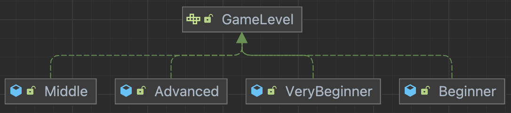

# Readable Code

### step 1: 추상

**도메인 용어 정리**

- `board`: 게임판
- `landMine`: 지뢰
- `gameStatus`: 게임 진행 상태

**이름 짓기**

- (가로, 세로): (`row`, `col`)
- 좌표 입력: `cellInput`
- 입력된 (가로, 세로): (`cellInputCol`, `cellInputRow`)
- 입력된 값의 좌표상 값: (`selectedColIndex`, `selectedRowIndex`)
- 수행할 행위 입력: `userActionInput`

**메서드 추상화하기 (추상화 레벨 맞추기)**

- 안내 문구 출력 메서드: `showGameStartComments()`
- 게임 세팅 초기화: `initializeGame()`
- 게임판 출력: `showBoard()`
- 입력된 col 값을 실제 좌표 상의 값으로 변환: `converColFrom(char cellInputCol)`
- 입력된 row 값을 실제 좌표 상의 값으로 변환: `converRowFrom(int cellInputRow)`
- 게임이 끝났는지 체크: `checkIfGameIsOver()`
  - 셀이 전부 열렸는지 체크: `isAllCellOpened()`
- 지뢰를 모두 찾았는가?: `doesUserWinTheGame()`
- 지뢰를 밟았는가?: `doesUserLoseTheGame()`
- 유저에게 좌표 입력 받기: `getCellInputFromUser()`
- 유저에게 행위 입력 받기: `getActionInputFromUser()`
- 입력으로부터 실제 좌표값 얻기: `getSelectedRowIndex()`,`getSelectedColIndex()`
- 사용자가 깃발을 선택했는가?: `doesUserChooseToPlantFlag()`
- 사용자가 오픈을 선택했는가?: `doesUserChooseToOpenCell()`
- 선택한 셀이 지뢰인가?: `isLandMineCell()`
- 지뢰를 밟은 경우 게임 상태 변경: `changeGameStatusToLose()`
- 전부 오픈한 경우 게임 상태 변경: `changeGameStatusToWin()`

**상수 추출하기**

- board, landMineCounts, landMines 배열은 그 자체의 값은 변하지 않으므로 상수
  - 그 안의 값이 바뀌는 것
  - gameStatus는 값이 변하므로 X
- `static final 반환타입 대문자상수명`
- `BOARD`, `NEARBY_LAND_MINE_COUNTS`, `LAND_MINES`
- 게임판의 가로 세로 길이도 자주 사용되므로 상수로 추출: `BOARD_ROW_SIZE, `BOARD_COL_SIZE`
  - 상수로 변환할 때 로직 체크 필수. 같은 값인데 의미가 다른 경우 주의
- 지뢰 개수: `LAND_MINE_COUNT`
- 셀의 4가지 상태: `FLAG_SIGN`, `LANE_MINE_SIGN`, `CLOSED_CELL_SIGN`, `OPENED_CELL_SIGN`

### step 2: 사고의 흐름이 자연스럽도록 개선

**Early return**

1. 메서드로 추출
2. if문 빠르게 return해서 else문 없애기

**depth 줄이기**

- 메서드 분리를 통해 중첩문의 depth를 줄인다.
- 사고의 depth를 줄이는 것에 집중할 것. 무조건 depth를 줄이려고 메서드 쪼개기만 한다면 더 복잡해질 것.

  - 이번 도메인의 경우 row와 col은 항상 이중 포문으로 같이 사용되기 때문에 depth를 줄이겠다고 메서드 분리를 하면 더 복잡해진다.
- tip) 메서드 리팩토링 시에는 메서드 복제 후 하는 것이 컴파일 에러를 최소화하면서 할 수 있다.

  - 메서드 복제 -> 메서드 리팩토링 -> 사용되는 곳에서 리팩토링 한 메서드로 대체해보기 -> 전부 대체 가능하면 기존 메서드 삭제 -> 리팩토링한 메서드명 기존 메서드명으로 변경
- 2중 for문으로 row, col을 접근하는 것은 게임판 전체에 접근하고 싶다는 의미: stream으로 모든 원소에 접근하는 방식으로 개선

  ```java
              Arrays.stream(BOARD)
                  .flatMap(Arrays::stream)
                  // ...
  ```
- 사용할 변수는 가깝게 선언하자

  - 자주 사용되고, 무거운 변수는 상수로 빼는 것도 고려해보자
- 공백을 통해 논리의 흐름을 끊어주자

**부정 연산자 피하기**

- 부정연산자 대신 반대되는 의미의 메서드를 사용하거나 메서드 자체에 부정의 의미를 담아서 개선
- `!isLeft()` -> `isRight()` 또는 `isNotLeft()`

**예외 처리**

- 예외 발생 가능성을 최대한 낮추고, 의도된 예외들은 알맞게 처리해주기
- 잘못된 입력이 들어왔을 때 프로그램이 종료되는 것이 아닌 사용자가 다시 입력할 수 있도록 처리
- `NullPointException` 대처, Optional 잘 알고 최대한 적게 사용하기
  - `equals()`와 같은 비교 메서드에서 NPE가 발생할 가능성 있다
  - `cell.equals(CLOSED_CELL_SIGN)` -> `CLOSED_CELL_SIGN.equals(cell)`
  - 검증된(확실히 존재하는) 값을 기준으로 비교 메서드 사용

### Step 3: 객체 지향 패러다임

**객체 설계**

- 기존에 게임판, 근처 지뢰 횟수, 지뢰 정보가 전부 따로 관리되고 있었다.
- row, col 사이즈도 똑같고, 하나의 셀의 특성이므로 객체로 관리할 수 있다. -> Cell 객체
- 기존의 4가지 SIGN 정보도 Cell 객체 내부에서 관리할 수 있다.

  - 정적 팩토리 메서드로 생성하도록 하고, 생성자는 private로 숨긴다. (항상 정답은 아니겠지만 정적 팩토리 메서드를 사용하면 메서드명을 줄 수 있어서 좋다.)
  - getter는 정말 필요할 때, setter는 그냥 만들지 말자
- `Cell[][]` 기반의 `BOARD2`를 만들어서 점진적으로 기존의 BOARD를 대체해가면서 리팩토링하자

  - 기존에 그냥 `SIGN값을` 넣어줬다면 이제는 `Cell.of(SIGN)`
- Cell의 SIGN 정보를 비교할 때에는 getter를 만드는 것이 아닌 Cell에 물어보는 방식(메서드)으로 구현

  - `cell.equalsSign(SIGN)`
- `showBoard()` 에서는 Cell에 그림을 그려달라고 하는 것이 더 이상하다. 그리는 쪽이 호출하는 쪽이니까 이럴 때에는 Cell에 물어보는 것이 아닌 getter를 사용해야할 때이다.
- 4가지 SING 상수 필드들도 전부 Cell 클래스 안에 넣는다. (같은 관심사이므로 묶기)

  - Cell 내부에서만 해당 사인들을 다룰 수 있도록 리팩토링한다.
- NEARBY_LANE_MINE_COUNT와 LAND_MINES 모두 Cell 안에서 다룰 수 있으므로 객체 안으로 집어넣자

  - Cell 안의 nearbyLandMindCount, isLandMine 필드로 표현 가능하다.

추가한 필드에 맞게 생성자들과 메서드들을 수정하다 보니 이상한 점이 있다. 사인들을 가질 때 추가한 두 필드의 값이 정해지지 않을 수 있다는 것이다.

- Cell이 가진 속성: 근처 지뢰 숫자, 지뢰 여부
- Cell의 상태: 깃발 유무, 열림 여부, 사용자의 확인 여부
  - 깃발이 꽂혔다는 것은 열리지는 않았지만 사용자가 확인은 한 상태이다.

기존의 게임 종료 조건은 모든 셀이 닫혀있지 않은 상태였지만, 사실은 모든 셀이 열려있거나 닫혀있는데 사용자가 깃발로 확인한 경우가 종료 조건이 되는 것이다.

**새로 얻게된 도메인 지식**

- opened / closed 개념과 사용자가 확인했다는 개념은 다르다.
- 즉, 닫혀있지만 깃발로 사용자가 확인한 경우 게임 종료 조건의 일부가 된다.
  - 따라서 모든 셀이 깃발이 꽂혀있거나, 오픈되어있는 경우가 게임 종료 조건이 된다.
- 또한, Cell의 정보가 변경되었을 때 Cell을 새로 만들어서 갈아 끼우는 것이 아니라 Cell이라는 객체의 상태를 변화시키는 방향으로 리팩토링해야한다.
  - 기존엔 지뢰 여부와 주변 지뢰 개수를 별도의 배열로 관리했기에 새로 갈아끼우기가 가능했던 것이다.

**리팩토링 과정**

- LAND_MINE의 배열 대신 BOARD의 해당하는 Cell에 대해 메서드를 통해 지뢰 상태를 변경할 수 있도록 한다.
- NEARBY_LANE_MINE_COUNTS의 초기화는 Cell 생성 시 해당 필드를 0으로 초기화하니까 없애도 된다.

  - 마찬가지로 이 외의 값 변경은 전부 Cell이 제공하는 메서드로 대체한다.
- 깃발은 isFlagged 필드로, 오픈 여부는 isOpened 필드로 만들어 상태 변경으로 표현한다.

  - 기존엔 FLAG 사인과 OPENED 사인으로 새로 Cell 생성해서 대체했었다.
- 모든 값들은 전부 상태로 관리될 수 있다. 강제로 객체를 새로 만들어서 사용하지 말자.

**SRP: 단일 책임 원칙**

1. 기존에 하나의 클래스(`MinesweeperGame`)로 구성된 것을 책임에 따라 분리해보자

- main 함수에서 모든 지뢰찾기 게임을 진행하고 있는데 main은 딱 프로그램을 실행하는 책임만 주고, 지뢰 게임은 `Minesweeper` 클래스로 따로 분리하자
  - main은 딱 `Minesweeper`를 생성해서 실행해주기만 함
  - main이라 static 키워드를 사용했었는데 클래스 분리하고 나서는 붙여줄 필요 없음

2. 입력과 출력 책임 분리

- 분리할 때 필요한 상수들은 같이 옮겨주던지 파라미터로 받던지 상황에 따라 선택하자
- 입력에 관한 건 전부 `ConsoleInputHandler`
- 출력에 관한 건 전부 `ConsoleOutputHandler`
  - 게임 시작 문구 출력 (`showGameStartComments()`)
  - 게임판 보드 출력 (`showBoard()`)
  - ...
- printExceptionMessage()의 파라미터는 에러 자체 e를 넣어주는 게 나을까 `e.getMessage()`를 넣어주는 게 나을까?
  - 정답은 없지만 메서드 선언부와 커스텀 에러의 다른 메서드들을 고려했을 때 에러 자체인 e를 넣어주는 게 나아보인다.

3. Board의 역할이 너무 많다. 상수로 관리하기에는 책임이 너무 많기 때문에 객체로 분리해보자

- row, col 크기만 알려주면 그 내부에는 Cell로 구성된 이중 배열인지는 알 필요 없이 GameBoard 객체 내부에서 관리되도록 분리한다.

  - Minesweeper 입장에서 GameBoard가 이중 Cell로 이루어져있는지 알지 못하고, 관심도 없다. (객체로 추상화되고, 캡슐화로 은닉되었기 때문)
- Board를 생성하고 초기화하고 이런 모든 관련된 작업들을 이제 다 GameBoard 객체로 책임을 분리해준다.
- `board[row][col].getSign()` -> 매우 무례하다!

  - cell에 접근해서 사인 바로 가져오는 건 cell 사용할 것도 아니면서 무작정 가져오는 일.
  - board에 정중히 sign값을 요청하자: `gameBoard.getSign(row, col)`
- 재귀적으로 주변을 돌면서 오픈하는 메서드도 gameBoard가 내부적으로 처리하도록 분리해줬다.

**OCP: 개방-폐쇄 원칙**

- 새로운 요구사항이 들어왔을 때 기존의 코드 변경 없이 시스템을 확장할 수 있어야 한다.

  - 새로운 요구사항
    - 게임의 난이도를 변경할 수 있어야 한다. (매우쉬움, 초급, 중급, 고급)
- 현재 상수로 이미 정해져있기 때문에 OCP를 지키지 않고 있는 상태이다.

1. 난이도에 따라 게임판 세팅이 유연하게 될 수 있도록 수정

- 난이도에 따라 유연하게 게임판의 크기를 조절하는 작업도 또 하나의 책임으로 보고 클래스로 분리한다. (SRP 원칙)
- 게임의 난이도를 인터페이스를 활용해 만들고, 난이도가 변경될 때마다 인터페이스의 구현체로 변경된 난이도의 클래스를 넣어주자
  - 인터페이스야 말로 추상화의 직접적인 표현
  - 
  - 인터페이스인 GameLevel을 Minesweeper에 넣어주는데 인터페이스라서 런타임 시점(프로그램 실행 시점)에 어떤 구현체(난이도)가 들어올지 모르는 상태이다.
    - 하지만 추상화된 인터페이스 스펙(메서드)를 알고 있기 때문에 유연하게 게임을 실행할 수 있는 것이다. (OCP 만족)
    - Enum 사용도 고려해볼만 하다. (GameLevel이 정해지면 변하지 않고, 레벨마다 사용하는 값들도 정해져 있어 Enum이 더 어울릴지도?)
  -
